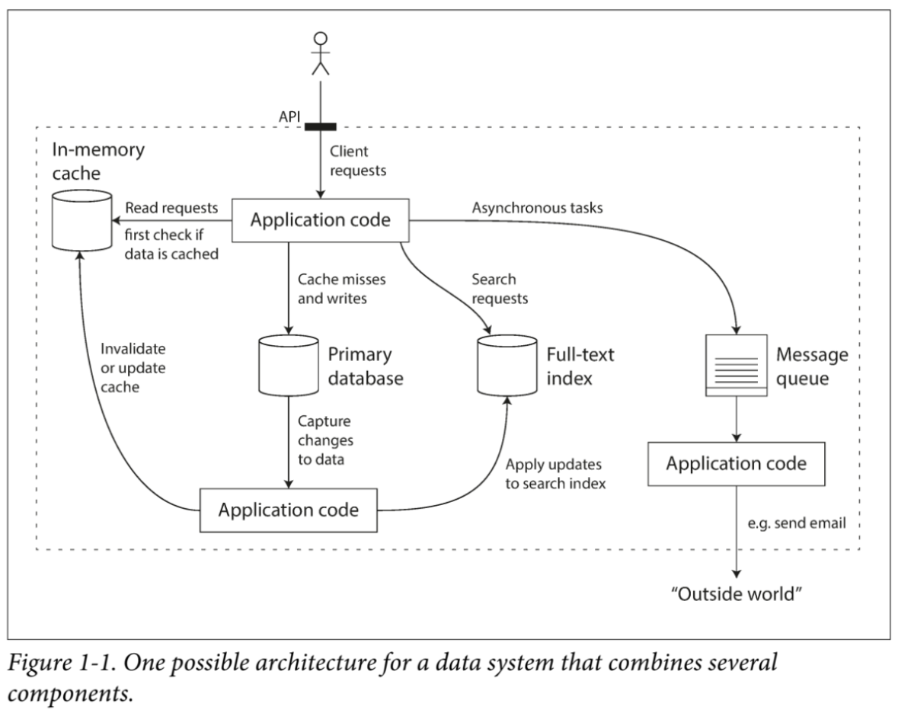

# Designing Data-Intensive Applications: The Big Ideas Behind Reliable, Scalable, and Maintainable Systems

by Martin Kleppmann

## Preface

* Internet companies are handling huge volumes of data and traffic, forcing them to create new tools that enable them to efficiently handle such scale
* An application is *data-intensive* if the quantity of data, the complexity of data, or the speed at which it is changing is the primary challenge
* After reading this book, you will be in a great position to decided which kind of technology is appropriate for which purpose, and understand how tools can be combined to form the foundation of a good application architecture
* [https://github.com/ept/ddia-references](https://github.com/ept/ddia-references) contains all up-to-date links mentioned in this book

## PART 1: Foundatations of Data Systems

The first four chapters go through the fundamental ideas that apply to all data systems, whether running on a single machine or distributed across a cluster of machines.

## Chapter 1: Reliable, Scalable, and Maintainable Applications

> This chapter focuses on the meaning of *reliability*, *scalability*, *maintainability*, and how we can try to achieve these goals.

Many applications today are *data-intensive*, as opposed to *compute-intensive*. These applications need to:

* Store data so that they, or another application, can find it again later (*databases*)
* Remember the result of an expensive operation, to speed up reads (*caches*)
* Allow users to search data by keyword or filter it in various ways (*search indexes*)
* Send a message to anoter process, to be handled asynchronously (*stream processing*)
* Periodically crunch a large amount of accumulated data (*batch processing*)

### Thinking About Data Systems

* When building an application, we still need to figure out which tools and which approaches are the most appropriate for the task at hand. It can be hard to combine tools when you need to do something that a single tool cannot do alone.
* Increasingly many applications now have such demanding or wide-ranging requirements that a single tool can no longer meet all of its data processing and storage needs
  * Instead the work is broken down into tasks that can be performed efficiently on a single tool, and those different tools are stitched together using application code
* When you combine several tools in order to provide a service, the service's application programming interace (API) usually hides implementation details from clients
  * You have created a new, special-purpose data system from smaller, general-purpose components
  * How do you ensure that the data remains correct and complete, even when things go wrong internally?
  * How do you provide consistently good performance to clients, even when parts of your system are degraded?
  * How do you scale to handle an increase in load?
  * What does a good API for the service look like?
  * And many more tricky questions will arise when you develop your data system

### Reliability

> The system should continue to work correctly (performing the correct function at the desired level of performance) even in the face of *adversity* (hardware or software faults, and even human error).

* The things that can go wrong are called *faults*
* Systems that anticipate faults and can cope with them are called *fault-tolerant* or *resilient*
* Being resilient to every fault is not practical, thus it makes sense to talk about tolerating *certain types* of faults
* Fault ≠ Failure
* A fault is a component of a system deviating from its spec
* A failure is when the system as a whole stops providing the required service to the user
* It is best to design fault-tolerance mechanisms that prevent faults from causing failures
* Using [chaos engineering](https://en.wikipedia.org/wiki/Chaos_engineering) can increase your confidence that faults will be handled correctly when they occur naturally

#### Hardware Faults

* Hardware faults (disk failure, losing power, unplugged network cable) happen all the time
* Hard disks have a mean time to failure (MTTF) of abou 10 to 50 years
* Adding redundant components cannout completely prevent hardware problems from causing failures, however they often keep a machine running uninterrupted for years
  * Disk in a RAID configuration
  * Servers with dual power supplies
  * diesel generators for backup power
* As long as you can restore a backup onto a new machine fairly quickly, the downtime in a case of a failure is not catastrophic in most applications
* As data volumes and applications' computing demands have increased, more applications have behan using larger numbers of machines
  * This proportionally increases the rate of hardware faults
  * In cloud platforms (AWS, Azure, Google Cloud) it is common for virtual machine instances to become unabilable without warning
    * These platforms are designed to prioritize flexibility and elasticity over single-machine reliability
* Hence a move towards systems that can tolerate the loss of entire machines, by using software fault-tolerance techniques in addition to hardware redundancy
  * These systems can be patched one node at a time, without downtime of the entire system ([rolling upgrade](https://en.wikipedia.org/wiki/Rolling_release)).
