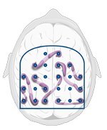
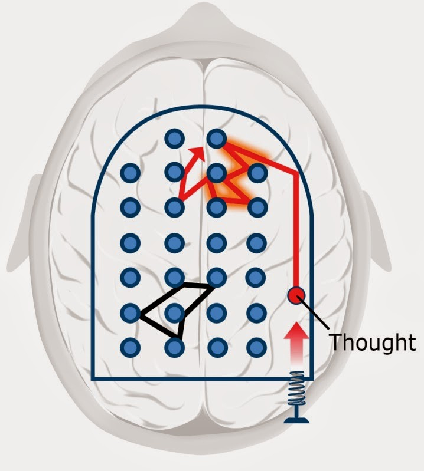

# Education
This is a set of useful informations that I've learned and I've created this README to help with [recall](https://en.wikipedia.org/wiki/Recall_(memory)).

---

### It's quite common to get stuck on a problem--often because you have initial ideas about what the solution should be that block your ability to see the real solution. What is a good next best step to take when you've already spent time reanalyzing the problem by focusing intently, and you find that you are simply stuck?

* Take a little break. You can focus on something different, or even just relax and not focus on anything at all, perhaps going out for a walk. 
* Taking a little break is a good idea. Taking your attention off of what you want to solve helps allow other neural modes to have access to the material. You won't be conscious of your brain continuing to work in the background on the problem--but it is!

### After you have become an expert at using the "Pomodoro technique," you should:

* Continue to use the "Pomodoro technique" when you have difficulty learning a subject or getting yourself motivated to get started on the task, but make sure to also take breaks in between your Pomodoro sessions. 
* The Pomodoro technique is a time-management, time-boxing technique in which the focused-learning mode is utilized on some task or logically related tasks for 25 minutes continuously, with zero interruptions. It helps you focus on learning, and when you break/reward yourself, it helps you internalize what you went through during the Pomodoro session.

### In the ___ mode, the brain makes random connections in a relaxed fashion.

diffuse

### Procrastination

* When you don't want to work on something, a sense of neural discomfort arises. However, researchers have found that not long after you might start working on something that you find unpleasant, that neural discomfort disappears. So an important aspect of tackling procrastination is to just get yourself through that initial period of discomfort. The Pomodoro technique helps you do that.
* Everybody has some issues with procrastination.
* Even if you keep right on task by prioritizing and working on the most important things, you are still procrastinating on whatever you are not working on. But if you are properly prioritizing your work--and also allowing for a little relaxation time in your life!--your problems with procrastination can be minimized.

### The focused mode is:

* Ideas, concepts, and problem-solving techniques that are at least somewhat familiar to you--your previous knowledge lays a sort of underlying neural pathway that you tend to follow.
* A pinball machine that has bumpers which are very tightly grouped together, so the pinball (the thought) can't go very far without bumping into a bumper.

### Sleep

* Too little sleep over too long a time is associated with all sorts of nasty conditions, including headaches, depression, heart disease, diabetes, and just plain dying earlier.
* During sleep, your brain erases the less important parts of memories and simultaneously strengthens areas that you need or want to remember.

### Memory

* Repetition is needed so your metabolic vampires--natural dissipating processes--don't suck the memories away.
* Research has shown that if you try to glue things into your memory by repeating something twenty times in one evening, for example, it won't stick nearly as well as if you practice it the same number of times over several days.
* Long term memory is like a storage warehouse.

### Practice

* Practice helps make memories more permanent.
* Neurons become linked together through repeated use. The more abstract something is, the more important it is to PRACTICE in order to bring these ideas into reality for you.

### Activities that would be more apt to arouse the diffuse (rather than focused) mode:

* Go for a walk.
* Getting some form of exercise while not concentrating on anything in particular.
* Take a shower.

### Exercise

* Helps improve your ability to learn and remember.
* Research is showing that exercise seems to be just as important as an enriched environment in allowing the brain to grow new neurons and remain healthy.

### Math and science might sometimes be more challenging because

* Math is not so directly related to emotions that we can feel.
* Math and science often involves more abstract, rather than concrete, ideas.
* In math and science, it's sometimes difficult to find analogous real-world concepts to point to--the abstract nature of a `+` symbol, for example, isn't like the word cow, which involves an animal you can directly point to.

### The ___ mode involves a direct approach to solving problems using rational, sequential, analytical approaches. It is associated with the concentrating abilities of the brain's prefrontal cortex, located right behind your forehead.

Focused

### According to Dr. Sejnowski’s, what happens in your brain during sleep that helps you remember new experiences?

Your brain forms new synapses.

### True statements about the human brain:

* Sleeping helps the brain form new synapses (neural connections).
* Brain connectivity is dynamic (that is, it changes), not static.

