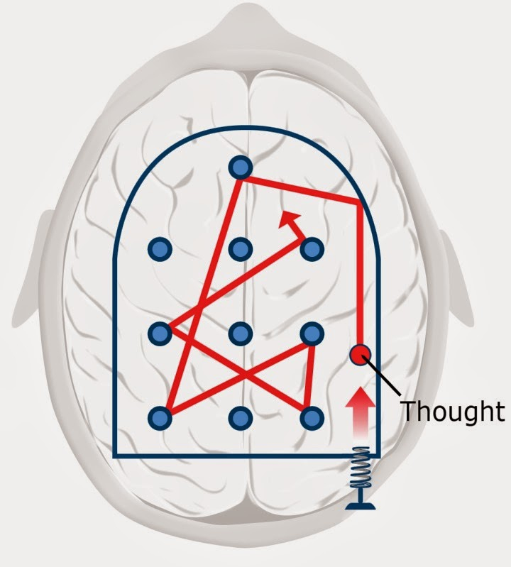
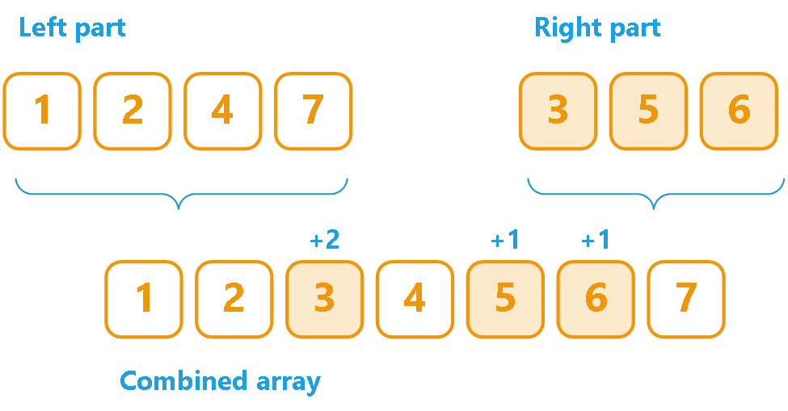

# Education
This is a set of useful informations that I've learned and I've created this README to help with [recall](https://en.wikipedia.org/wiki/Recall_(memory)).

---

## Learning How To Learn

### It's quite common to get stuck on a problem--often because you have initial ideas about what the solution should be that block your ability to see the real solution. What is a good next best step to take when you've already spent time reanalyzing the problem by focusing intently, and you find that you are simply stuck?
<details>

* Take a little break. You can focus on something different, or even just relax and not focus on anything at all, perhaps going out for a walk. 
* Taking a little break is a good idea. Taking your attention off of what you want to solve helps allow other neural modes to have access to the material. You won't be conscious of your brain continuing to work in the background on the problem--but it is!
</details>

### After you have become an expert at using the "Pomodoro technique," you should:
<details>

* Continue to use the "Pomodoro technique" when you have difficulty learning a subject or getting yourself motivated to get started on the task, but make sure to also take breaks in between your Pomodoro sessions. 
* The Pomodoro technique is a time-management, time-boxing technique in which the focused-learning mode is utilized on some task or logically related tasks for 25 minutes continuously, with zero interruptions. It helps you focus on learning, and when you break/reward yourself, it helps you internalize what you went through during the Pomodoro session.
</details>


### In the ___ mode, the brain makes random connections in a relaxed fashion.
<details>
diffuse



</details>


### Procrastination
<details>

* When you don't want to work on something, a sense of neural discomfort arises. However, researchers have found that not long after you might start working on something that you find unpleasant, that neural discomfort disappears. So an important aspect of tackling procrastination is to just get yourself through that initial period of discomfort. The Pomodoro technique helps you do that.
* Everybody has some issues with procrastination.
* Even if you keep right on task by prioritizing and working on the most important things, you are still procrastinating on whatever you are not working on. But if you are properly prioritizing your work--and also allowing for a little relaxation time in your life!--your problems with procrastination can be minimized.
</details>


### The focused mode is:
<details>

* Ideas, concepts, and problem-solving techniques that are at least somewhat familiar to you--your previous knowledge lays a sort of underlying neural pathway that you tend to follow.
* A pinball machine that has bumpers which are very tightly grouped together, so the pinball (the thought) can't go very far without bumping into a bumper.


</details>


### Sleep
<details>

* Too little sleep over too long a time is associated with all sorts of nasty conditions, including headaches, depression, heart disease, diabetes, and just plain dying earlier.
* During sleep, your brain erases the less important parts of memories and simultaneously strengthens areas that you need or want to remember.
</details>


### Memory
<details>

* Repetition is needed so your metabolic vampires--natural dissipating processes--don't suck the memories away.
* Research has shown that if you try to glue things into your memory by repeating something twenty times in one evening, for example, it won't stick nearly as well as if you practice it the same number of times over several days.
* Long term memory is like a storage warehouse.
</details>


### Practice
<details>

* Practice helps make memories more permanent.
* Neurons become linked together through repeated use. The more abstract something is, the more important it is to PRACTICE in order to bring these ideas into reality for you.
</details>


### Activities that would be more apt to arouse the diffuse (rather than focused) mode:
<details>

* Go for a walk.
* Getting some form of exercise while not concentrating on anything in particular.
* Take a shower.
</details>


### Exercise
<details>

* Helps improve your ability to learn and remember.
* Research is showing that exercise seems to be just as important as an enriched environment in allowing the brain to grow new neurons and remain healthy.
</details>


### Math and science might sometimes be more challenging because
<details>

* Math is not so directly related to emotions that we can feel.
* Math and science often involves more abstract, rather than concrete, ideas.
* In math and science, it's sometimes difficult to find analogous real-world concepts to point to--the abstract nature of a `+` symbol, for example, isn't like the word cow, which involves an animal you can directly point to.
</details>


### The ___ mode involves a direct approach to solving problems using rational, sequential, analytical approaches. It is associated with the concentrating abilities of the brain's prefrontal cortex, located right behind your forehead.
<details>
Focused


</details>


### According to Dr. Sejnowski’s, what happens in your brain during sleep that helps you remember new experiences?
<details>Your brain forms new synapses.</details>


### True statements about the human brain:
<details>

* Sleeping helps the brain form new synapses (neural connections).
* Brain connectivity is dynamic (that is, it changes), not static.
</details>


### The Law of Serendipity
<details>

Lady Luck favors the one who tries
</details>


### Which three methods are more likely to produce illusions of competence in learning?
<details>

1. Concept mapping
2. Rereading the text
3. Highlighting more than one or so sentence in a paragraph

#### Concept Mapping
Although concept mapping can have its place, research has shown that it's less effective than another powerful technique--simple recall. Remember, connecting concepts isn't going to help if you don't have the concepts already well-embedded in the brain. It's like trying to learn higher strategy in chess without having learned the basics about how the pieces move.

#### Rereading The Text
When the text is open right in front of you, it fools you into thinking that you know the material. But you only really know that material for certain when you can recall the material--or at least the key ideas--WITHOUT the text open in front of you.

#### Highlighting more than one or so sentence in a paragraph
With highlighting, the fact that your hand is moving can fool you into thinking you're putting something into your brain, when you're not.
</details>


### Transfer
<details>

The idea that a chunk you’ve mastered in one area can often help you much more easily learn chunks of information in different areas that can share surprising commonalities.
</details>


### Chunks/Chunking
<details>

- Improvising a new sentence in a new language you are learning involves the ability to creatively mix together various complex minichunks and chunks (sounds and words) that you have mastered in the new language.
- Chunks can help you understand new concepts. This is because when you grasp one chunk, you will find that that chunk can be related in surprising ways to similar chunks not only in that field, but also in very different fields.
- One of the first steps toward gaining expertise in academic topics is to create conceptual chunks-mental leaps that unite scattered bits of information through meaning.
- The bigger and more well-practiced your chunked mental library-whatever the subject you are learning-the more easily you will be able to solve problems and figure out solutions.
- The ability to combine chunks in new and original ways underlies a lot of historical innovation.
  - Bill Gates and other industry leaders set aside extended, modulelong reading periods so that they can hold many and varied ideas in mind during one time. This helps generate their own innovative thinking by allowing fresh-in-mind, not-yet-forgotten ideas to network among themselves.
- Chunking isn't all you need to develop creative flexibility in your learning-but it's an important component.
- Basically, what people do to enhance their knowledge and gain expertise is to gradually build the number of chunks in their mind-valuable bits of information that they can piece together in new and creative ways.
</details>


### Which of the following observations related to the "octopus of attention" analogy are true?
<details>

- When you are stressed, your "attentional octopus" begins to lose the ability to make connections. This is why your brain doesn't seem to work right when you're angry, stressed, or afraid.
- Focusing your "octopus of attention" to connect parts of the brain to tie together ideas is an important part of the focused mode of learning. It is also often what helps get you started in creating a chunk.


</details>


### Three Steps that are vitally important in making a chunk
<details>

1. Understanding of the basic idea
2. Practice to help you gain mastery and a sense of the big-picture context.
3. Focused attention
</details>


### Deliberate Practice
<details>

Focusing intently on the parts of the problem that are more difficult to you. Deliberate practice is continuing to focus of the material you find hardest and is important to productive studying.
</details>


### Context
<details>

Where bottom up and top down learning meet.

Learning takes place in two ways. There's a bottom up chunking process, where practicing repetition can help you both build and strengthen each chunk, so you can easily access it whenever you need to. And there is also a sort of a top down big picture process that allows you to see what you are learning and where it fits in. Both processes are vital in gaining mastery over the material. "Context" is where bottom up and top down learning meet.
</details>


### Learning
<details>

- Once you’ve got the basic idea down during a session, continuing to hammer away at it during the same session doesn’t strengthen the kinds of long-term memory connections you want to have strengthened. Worse yet, focusing on one technique is a little like learning carpentry by only practicing with a hammer. After a while, you think you can fix anything by just bashing it.
- Interleaving your studies—making a point to review for a test, for example, by skipping around through problems in the different chapters and materials—can sometimes seem to make your learning more difficult. But in reality, it helps you learn more deeply.
- One significant mistake students sometimes make in learning is jumping into the water before they learn to swim. In other words, they blindly start working on homework without reading the textbook, attending lectures, viewing online lessons, or speaking with someone knowledgeable. It’s like randomly allowing a thought to pop off in the focused-mode pinball machine without paying any real attention to where the solution truly lies. 
- Although practice and repetition are important in helping build solid neural patterns to draw on, it’s interleaving that starts building flexibility and creativity.  It’s where you leave the world of practice and repetition and begin thinking more independently.
</details>


### Einstellung
<details>

Einstellung is when your initial thought, an idea you already have in mind, or a neural pattern you’ve already developed and strengthened, prevents a better idea or solution from being found, or keeps you from being flexible enough to accept new, better, or more appropriate solutions.
</details>


### The neuromodulators acetylcholine, dopamine, and serotonin were mentioned as affecting specific areas. What are the three true statements about which areas these neurotransmitters affect?
<details>

- Acetylcholine affects focused learning and attention
- Dopamine signals in relation to unexpected reward
- Serotonin affects social life and risk-taking behavior
</details>


### Which methods can help when trying to learn something new?
<details>

- Analogy
- Metaphor
</details>


---
## Algorithms

### Definition of Big O Notation
<details>

Let `T(n)` be a function on `n = 1, 2, 3,...`. Then `T(n) = O(f(n))` if and only if there exist constant `c, n_0 > 0` such that `T(n) <= cf(n)`. For all `n >= n_0`.
</details>


### Definition of Big ![Big Omega Symbol][big_omega] Notation
<details>

Let `T(n)` be a function on `n = 1, 2, 3,...`. Then ![tn_omega_fn][tn_omega_fn] if and only if there exist constant `c, n_0 > 0` such that `T(n) >= cf(n)`. For all `n >= n_0`.

[tn_omega_fn]: https://render.githubusercontent.com/render/math?math=T(n)%20=%20\Omega(f(n))
[big_omega]: https://render.githubusercontent.com/render/math?math=\Omega
</details>


### Definition of Big ![Big Theta Symbol][big_theta] Notation
<details>

Let `T(n)` be a function on `n = 1, 2, 3,...`. Then ![tn_theta_fn][tn_theta_fn] if and only if ![tn_omega_fn] and `T(n) = O(f(n))`.

[tn_theta_fn]: https://render.githubusercontent.com/render/math?math=T(n)%20=%20\Theta(f(n))
[big_theta]: https://render.githubusercontent.com/render/math?math=\Theta
</details>


### Karatsuba Multiplication
<details>

Karatsuba Mutiplication is a recursive algorithm for multiplying two `n` digit numbers.

* Time Complexity: `O(n^(log_2(3)))` which is approximately `O(n^1.59)`
* Space Complexity: `O(n)`


```
// x = 10^(n/2) * a + b
// y = 10^(n/2) * c + d
// x * y = 10^n * a * c  + 10^(n/2) * (a * d + b * c) + (b * d)
// 1. Recursively compute ac
// 2. Recursively compute bd
// 3. Recursively compute (a + b)(c + d) = ac + bd + ad + bc
// Gauss' Trick: (3) - (1) - (2) = ad + bc
// Upshot: Only need three recursive multiplications (and some additions)
def karatsuba(x, y) {
    if (x < 10 && y < 10) {
        return x * y
    }

    // calculate the size of the input (the number of digits)
    n = min(size_base10(x), size_base10(y))
    nHalf = n / 2

    // split the digits in the middle
    xHigh, xLow = split_at(x, nHalf)
    yHigh, yLow = split_at(y, nHalf)

    // 3 calls made to numbers that are approximately half the size
    z0 = karatsuba(xLow, yLow)
    z1 = karatsuba((xLow + xHigh), (yLow + yHigh))
    z2 = karatsuba(xHigh, yHigh)

    return (z2 * 10^(nHalf * 2)) + ((z1 - z2 - z0) * 10^nHalf) + z0
}
```

*Here is the [implementation](../algorithms-data-structures/karatsuba-multiplication/Karatsuba.java)*
</details>


### Merge Sort
<details>

[Merge sort](https://en.wikipedia.org/wiki/Merge_sort) is a [divide and conquer](https://en.wikipedia.org/wiki/Divide-and-conquer_algorithm) that sorts an array of `n` numbers.

* Time Complexity: `O(nlogn)`
* Space Complexity: `O(n)`


```
/**                                                                                                                             
 * Given the array of integers, sort them in ascending order.                                                                   
 * @param nums - The list of numbers                                                                                            
 * @param left - The start index                                                                                                
 * @param right - The end index                                                                                                 
 */                                                                                                                             
private static void mergeSort(int[] nums, int left, int right) {                                                                
  if (left >= right) {
      return;
  }

  // Get the middle index between [left, right] using bit shift to prevent overflow
  int mid = left + ((right - left) >> 1);

  mergeSort(nums, left, mid);
  mergeSort(nums, mid + 1, right);

  // merge the left and right in sorted order
  int[] sorted = new int[right - left + 1];

  int sortedIndex = 0;
  int leftIndex = left;
  int rightIndex = mid + 1;

  while (leftIndex <= mid && rightIndex <= right) {
      if (nums[leftIndex] < nums[rightIndex]) {
      sorted[sortedIndex] = nums[leftIndex++];
      } else {
      sorted[sortedIndex] = nums[rightIndex++];
      }
      sortedIndex += 1;
  }

  // copy the rest of elements into the sorted array
  while (leftIndex <= mid) sorted[sortedIndex++] = nums[leftIndex++];
  while (rightIndex <= right) sorted[sortedIndex++] = nums[rightIndex++];

  // sort the original nums array
  for (int i = 0; i < sorted.length; i++) {
      nums[left + i] = sorted[i];
  }
}
```

*Here is the [implementation](../algorithms-data-structures/merge-sort/MergeSort.java)*
</details>

### Counting Inversions
<details>

Counting inversions is a problem of counting the number of pairs of indices `(i, j)` in an array `nums` where `i < j` and `nums[i] > nums[j]`.

* Input: Array `nums` containing the numbers `1, 2, 3,..., n` in some arbitrary order
* Output: Number of inversions = number of pairs `(i, j)` of array indices with `i < j` and `nums[i] > nums[j]`.

Turns out we could use a [divide and conquer](https://en.wikipedia.org/wiki/Divide-and-conquer_algorithm) algorithm similar to merge sort to help us solve this problem.



* Time Complexity: `O(nlogn)`
* Space Complexity: `O(n)`

```
/**                                                                                                                             
 * Given the array of integers, count the number of inversions in this array between the indices [left, right].                 
 * https://en.wikipedia.org/wiki/Inversion_(discrete_mathematics)                                                               
 * @param nums - The list of numbers                                                                                            
 * @param left - The start index                                                                                                
 * @param right - The end index                                                                                                 
 * @return int - The number of inversions                                                                                       
 */                                                                                                                             
private static long countInversions(int[] nums, int left, int right) {                                                          
  if (left >= right) {                                                                                                          
    return 0;                                                                                                                   
  }                                                                                                                             
                                                                                                                                
  // Get the middle index between [left, right] using bit shift to prevent overflow                                             
  int mid = left + ((right - left) >> 1);                                                                                       
                                                                                                                                
  long leftInversions = countInversions(nums, left, mid);                                                                       
  long rightInversions = countInversions(nums, mid + 1, right);                                                                 
                                                                                                                                
  // merge the left and right in sorted order while counting the inversions                                                     
  int[] sorted = new int[right - left + 1];                                                                                     
                                                                                                                                
  long numInversions = leftInversions + rightInversions;                                                                        
  int sortedIndex = 0;                                                                                                          
  int leftIndex = left;                                                                                                         
  int rightIndex = mid + 1;                                                                                                     
                                                                                                                                
  while (leftIndex <= mid && rightIndex <= right) {                                                                             
    if (nums[leftIndex] < nums[rightIndex]) {                                                                                   
      sorted[sortedIndex] = nums[leftIndex++];                                                                                  
    } else {                                                                                                                    
      sorted[sortedIndex] = nums[rightIndex++];                                                                                 
      numInversions += (mid - leftIndex + 1);                                                                                   
    }                                                                                                                           
    sortedIndex += 1;                                                                                                           
  }                                                                                                                             
                                                                                                                                
  // copy the rest of elements into the sorted array                                                                            
  while (leftIndex <= mid) sorted[sortedIndex++] = nums[leftIndex++];                                                           
  while (rightIndex <= right) sorted[sortedIndex++] = nums[rightIndex++];                                                       
                                                                                                                                
  // sort the original nums array
  for (int i = 0; i < sorted.length; i++) {
    nums[left + i] = sorted[i];
  }

  return numInversions;
}
```

*Here is the [implementation](../algorithms-data-structures/counting-inversions/CountingInversions.java)*
</details>


### The Master Method
<details>

The [master method](https://en.wikipedia.org/wiki/Master_theorem_(analysis_of_algorithms)) provides an asymptotic analysis (using `Big O Notation`) for recurrence relations of types that occur in the analysis of many divide and conquer algorithms.

* **Cool Feature**: A "black box" for solving recurrences.
* **Assumption**: All subproblems have equal size.

#### Recurrence Format
1. **Base Case**: `T(n)` <= some constant for all sufficiently small `n`
2. **For all larger n**: `T(n) <= a * T(n/b) + O(n^d)`

Where
* `a` = number of recursive calls (`>= 1`)
* `b` = input size shrinkage factor (`> 1`)
* `d` = exponent in the running time of the "combine step" (`>= 0`)

*[a, b, d, are **independent** of n]*

#### The Theorem
`T(n)` is one of:

1. `O(n^d * logn)`                  **if a = b^d**
2. `O(n^d)`                         **if a < b^d (root heavy)**
3. `O(n^log_b(a)) = O(a^log_b(n))`  **if a > b^d (leaves heavy)**

*Note: In case 3 the base of the logarithm matters!*
</details>