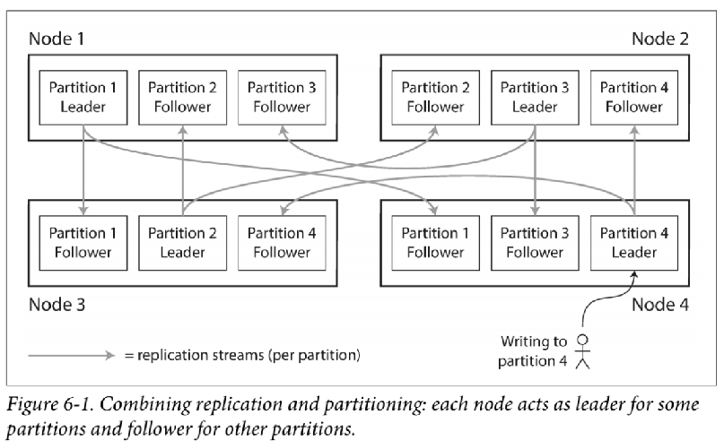
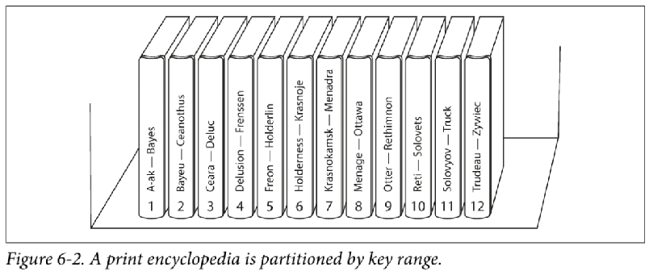
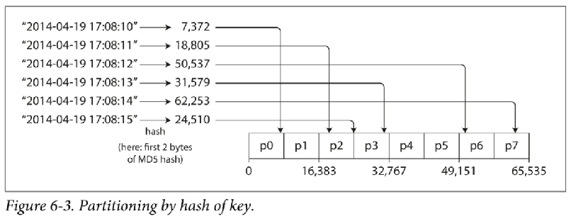
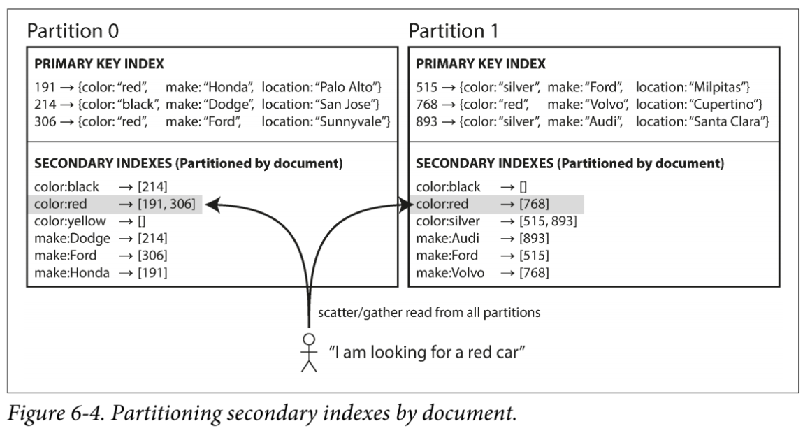
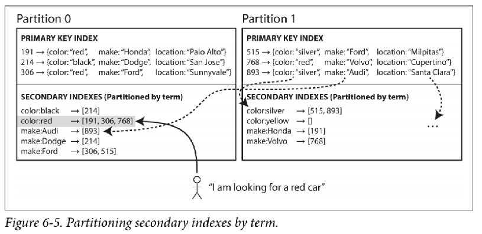
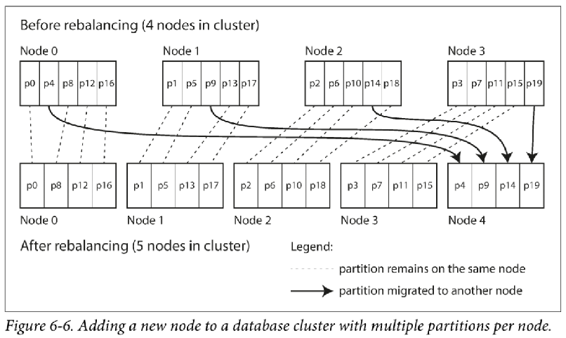
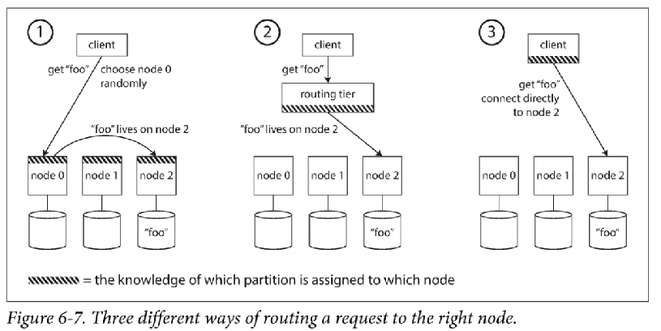
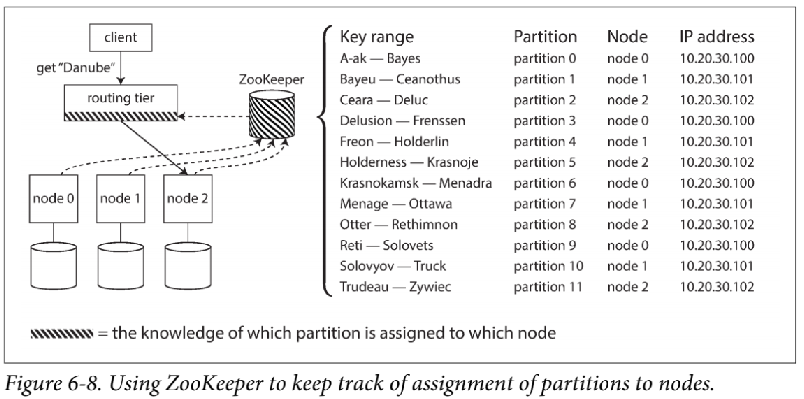

## Chapter 06 - Partitioning

* Partitioning (also known as sharding) is the breaking up of very large datasets or very high query throughput.
* Each partition is a small database of its own, although the database may support operations that touch multiple paritions at the same time
* Main reason for wanting to partition data is scalability
* Large dataset can be distributed across many disks, and the query load can be distributed across many processors
* For queries that operate on a single partition, each node can independently execute the queries on its own partition
  * Query throughput can be scaled by adding more nodes

### Partitioning and Replication
* Partitioning is usually combined with replication so that copies of each partition are stored on multiple nodes
  * Record that belongs to one partition could be stored on several different nodes for fault tolerance
* Each node may be the leader for some partitions and a follower for other partitions
* The choice of partitioning scheme is mostly independent of the choice of replication scheme

 

### Partitioning of Key-Value Data
* Say you have a lage amount of data, and you want to partition it.
  * How do you decide which records to store on which nodes?
* Our goal with partitioning is to spread the data and the query load evenly across nodes
  * *In theory 10 nodes should be able to handle 10 times as much data and 10 times the read and write throughput of a single node*
* If the partitioning is unfair, so that some partitions have more data or queries than others, we call it **skewed**
  * A partition with disproportionately high load is called a **hot spot**

#### Partitioning by Key Range
* Let's assume for now that you have a simple key-value data model, in which you always access a record by its primary key.
* One way of partitioning is to assign a continuous range of keys to each partition
* If you know the boundaries between the ranges, you can easily determine which partition contains a given key
* If you also know which partition is assigned to which node, then you can make your request directly to the appropriate node
* The ranges of the keys are not necessarily evenly spaced (i.e., Volume 1 is from A->B and Volume 12 is from T->Z)
* In order to distribute the data evenly, the partition boundaries need to adapt to the data
  * Boundaries could be chosen manually by an administrator, or the database can choose them automatically
* Within each partition, we can keep keys in sorted order (SSTables and LSM-Trees)
  * Upside; range scans are easy (i.e., Fetching data that use timestamp as the key)
  * Downside; certain access patterns can lead to hot spots

 

#### Partitioning by Hash of Key
* Because of this risk of skew and hot spots, many distributed datasources use a hash function to determine the partition for a given key
* A good hash function takes skewed data and makes it uniformly distributed
  * The hash function need not be cryptographically strong
  * Cassandra and MongoDB use **MD5**
* Many programming languages have simple hash functions built in (i.e., Java `Object.hashCode()`)
* Once you have a suitable hash function for keys, you can assign each partition a range of hashes (rather than a range of keys)
  * Every key whose hash falls within a partition's range will be stored in that partition
* This technique is good at distributing keys fairly among the partitions
* By using hash of the key for partitioning we lose the ability to do efficient range queries
  * Keys that were once adjacent (in key-range partitioning) are now scattered across all the partitions, so their sort order is lost

 

##### Consistent Hashing
* A way of evenly distributing load across an internet-wide system of caches such as a content delivery network (CDN).
* It uses randomly chosen partition boundaries to avoid the need for central control or distributed consensus
* This particular approach actually doesn't work very well for databases
  * It is rarely used in practice and the documentation of some databases (i.e., Cassandra) still refer to consistent hashing, but it is often inaccurate

#### Skewed Workloads and Relieving Hot Spots
* In extreme cases where all reads and writes are for the same key, you still end up with all requests being routed to the same partition
  * A celebrity/politician (i.e., POTUS) with millions of followers may cause a storm of activity when they do something
* Hashing the key (i.e., user ID of the celebrity) doesn't help, as the hash of two identical IDs is still the same
* Even today, most data systems are not able to automatically compensate for such a highly skewed workload, so it's the responsibility of the application to reduce the skew
* We could split **hot** keys by appending a random number
  * We'll need some way of keeping track of which keys are being split
* Perhaps in the future, data systems will be able to automatically detect and compensate for skewed workloads, but for now, you need to think through the trade-offs for your own application

### Partitioning and Secondary Indexes
* A secondary index usually doesn't identify a record uniquely but rather is a way of searching for occurrences of a particular value (i.e., find all cars whose color is red)
* Secondary indexes are common in relational databases and document databases
* Secondary indexes are the main reason for Elasticsearch to exist
* Many key-value stores (i.e., HBase) avoid secondary indexes due to added complexity
* The problem with secondary indexes is that they don't map neatly to partitions

#### Partitioning Secondary Indexes by Document
i.e., A used car website that lets users search for cars and filter by color and by make.
* Each listing has a unique ID (call it *document ID*) and we partition the database by the document ID
* Whenever a **red** car is added to the database, the database partition automatically adds it to the list of document IDs for the index entry `color:red`

 

* In this indexing approach, each partition is completely seperate
* Each partition mantains its own secondary indexes, covering only the documents in that partition
* It doesn't care what data is stored in other partitions
* Whenever you need to write to the database (to add, remove, or update a document) you only need to deal with the partition that contains the document ID that you are writing

 

* Querying from a document-partitioned index is non-trivial
  * There is no reason why all the cars with a particular color (i.e., red) or a particular make would be in the same partition
* You need to send the query to all partitions, and combine all the results you get back (somtimes known as *scatter/gather*)
* Read queries on document-partitioned secondary indexes are quite expensive
  * Still widely used: MongoDB, Riak, Cassandra, Elasticsearch

 

#### Partitioning Secondary Indexes by Term
* Rather than each partition having its own secondary index (a local index), we can construct a global index that covers data in all partitions
  * We can't just store that index on one node, since it would likely become a bottleneck and defeat the purpose of partitioning
* A global index must also be partitioned, but it can be partitioned differently from the primary key index

 

* In Figure 6-5, *red cars* from all partitions appear under `color:red` in the index
* Index is partitioned so that colors starting with the letters a to r appear in partition 0 and colors starting with s to z appear in partition 1
* The index on the make of the car is partitioned with boundary being between f and h

 

* This is called `term-partitioned` because the term we're looking for determines the partition of the index
* Term partitioning using a hash of the term gives a more even distribution of load
* Term partitioning by the term itself can be useful for range scans
* Upside; reads are more efficient on a global (term-partitioned) index over a document-partitioned index
* Downside; writes are slower and more complicated, because a write to a single document may now affect multiple partitions of the index (every term in the document might be on a different partition, on a different node)
* In practice, updates to global secondary indexes are often asynchronus
  * i.e., Amazon DynamoDB states that its global secondary indexes are updated within a fraction of a second in normal circumstances, but may experience longer propagation delays in cases of faults in the infrastructure

### Rebalancing Partitions
Bebalancing: the process of moving load from one node in the cluster to another

* After rebalancing, the load (data storage, read and write requests) should be shared fairly between the nodes in the cluster
* While rebalancing is happening, the database should continue accepting reads and writes
* No more data than necessary should be moved between nodes, to make rebalancing fast and to minimize the network and disk I/O load

#### Strategies for Rebalancing

##### How not to do it: `hash mod N`
* If the number of nodes `N` changes, most of the keys will need to be moved from one node to another when we add or remove a node

##### Fixed number of partitions
* Create many more partitions than there are nodes, and assign several partitions to each node (i.e., 1000 partitions with 100 nodes)
* If a node is added to the cluster, the new node can steal a few partitions from every existing node until partitions are faily distributed once again
* If a node is removed from the cluster, the same happens in reverse
* Entire partitions are moved between nodes, the number of partitions does not change, nor does the assignment of keys to partitions
* It takes some time to transfer a large amount of data over the network, so the old assignment of partitions is used for any read and writes that happen while the transfer is in progress
* Approach used in Riak, Elasticsearch, Couchbase
* Each partition also has management overhead, so it's counterproductive to choose too high a number

 

##### Dynamic Partitioning
* A fixed number of partitions with fixed boundaries would be very inconvenient if you got the boundaries wrong
  * You could end up with all of the data in one partition and all of the other partitions empty
* HBase and RethinkDB create partitions dynamically
* When a partition grows to exceed a configured size (i.e., 10 GB), it is split into two partitions so that approximately half of the data ends up on each side of the split
* If lots of data is deleted and a partition shrinks below some threshold, it can be merged with an adjacent partition
* Each partition is assigned to one node and a node could have multiple partitions
After a large partition has been split, one of its two halves can be transferred to another node in order to balance the load
* The number of partitions adapts to the total data volume
  * If there is only a small amount of data, a small number of partitions is sufficient, so overheads are small, if there is a huge amount of data, the size of each individual partition is limited to a configurable maximum
* Dynamic partitioning is suitable for both key range-partitioned data and hash-partitioned data.

##### Partitioning proportionally to nodes
* The number of partitions are proportional to the number of nodes
  * Used by Cassandra
* Fixed number of partitions per node (i.e., 256 is the default in Cassandra)
* Size of each partition grows proportionally to the dataset size while the number of nodes remain unchanged
* Increasing the number of nodes makes the partitions smaller
* When a new node joins the cluster, it **randomly** chooses a fixed number of existing partitions to split, and then takes ownership of one half of each of those split partitions while leaving the other half of each partition in place
  * The randomization can produce unfair split, but when averaged over a large number of partitions, the new node ends up taking a fair share of the load from existing nodes
* Picking partition boundaries randomly requires that hash-based partitioning is used so the boundaries can be picked from the range of numbers produced by the hash function

#### Operations: Automatic or Manual Rebalancing
* Convenient because there is less operational work to do for normal maintence
* It can be unpredictable
  * Rebalancing is an expensive operation, because it requires rerouting requests and moving a large amount of data from one node to another
  * This process can overload the network or the nodes and harm the performance of other requests while the rebalancing is in progress
* Automation can be dangerous in combination with automatic failure detection
* It can be a good thing to have a human in the loop for rebalancing. It's slower than a fully automatic process, but it can help prevent operational surprises

### Request Routing
* After partitioning our dataset across multiple nodes running on multiple machines, how does a client know which node to connect to?
* This is an instance of a more general problem called *service discovery*
  * Many companies have written their own in-house service discovery tools (Palantir Skylab)

 

#### Three main ways
1. Allow clients to contact any node. If that node coincidentaly owns the partition to which the request applies, it can handle the request directly; otherwise, it forwards the request to the appropriate node, receives the reply, and passes the reply along to the client
2. Send all request from clients to a routing tier first, which determines the node that should handle each request and forwards it accordingly. This routing tier does not itself handle any requests; it only acts as a partition-aware load balancer
3. Require that clients be aware of the partitioning and the assignment of partitions to nodes. In this case, a client can connect directly to the appropriate node, without any intermediary.

 

* Many distributed systems rely on a seperate coordination service such as ZooKeeper to keep track of this cluster metadata
* Each node registers itself in ZooKeeper, and ZooKeeper maintains the authoritative mapping of partitions to nodes
* Other actors (such as routing tier, clients, etc. can subscribe to this information in ZooKeeper)
* Whenever a partition changes ownership, or a node is added or removed, ZooKeeper notifies the routing tier so that it can keep its routing information up to date

 

* Cassandra and Riak take a different approach: they use a gossip protocol among the nodes to disseminate any changes in the cluster state
* Requests can be sent to any node, and that node forwards them to the appropriate node for the requested partition
* More complexity in the database nodes but avoids the dependency on an external coordination service such as ZooKeeper

 

### IP Addresses
* Clients still need to find the IP addresses to connect to
  * These are not fast-changing as the assignment of partitions to nodes, so it is often sufficient to use DNS for this purpose
