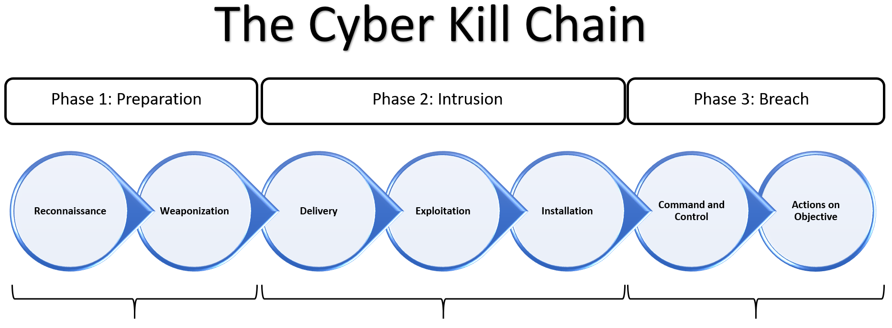

# Gray Hat Hacking: The Ethical Hacker's Handbook, Sixth Edition

by Allen Harper (Author), Ryan Linn  (Author), Stephen Sims (Author), Michael Baucom (Author), Huascar Tejeda  (Author), Daniel Fernandez (Author), Moses Frost  (Author)

## Chapter 01: Gray Hat Hacking

Gray hat hackers are those that choose to operate within the law and ethically, using research and adversarial knowledge to better the world by improving defenses surrounding technology.

* White hat hackers are paid employees for an organization/government.
* Gray hat hackers find issues in a system without the owner's permission
  * Gray hat hackers report the issue to the owner, sometimes requesting money to fix that issue.
* Black hat hackers are criminals who violate computer security for malicious intent.

### Vulnerabilities

* Software vulnerabilities are weakness in either the design or implementation of software that may be exploited by an attacker.
* Synopsys produced a reported after analyzing 10 billion lines of code:
  * Commercial code has 0.61 defects (bugs) per 1,000 lines of code
  * Open source software had 0.76 defects per 1,000 lines of code
  * 1 - 5 percent of software defects turn out to be vulnerabilities
* Modern (written in 2023) applications could have millions of lines of code, thus typically have dozens of security vulnerabilities.
* As long as we have humans developing software, we will have vulnerabilities.

### Disclosure of Vulnerabilities

#### Full Vendor Disclosure

* Around the year 2000, security researchers were more likely to cooperate with vendors and perform full vendor disclosure
  * Vendors were more open to accept public feedback without resorting to legal action
  * Vendors required the researcher to sign a non-disclosure agreement (NDA)
    * This resulted in unlimited period of time to patch a vulnerability
  * Software Vendors struggled with how to manage distribution of updates to customers
    * Too frequent updates could result in the loss of trust from the customer
    * Some consumers had complicated environments and patching presented logistical problems
    * Taking too long to patch could give hackers sufficient time to reverse engineer the patch and create a new exploit

#### Full Public Disclosure

* Frustration built in the hacker community as vendors were not seen as playing fairly or taking the reseachers seriously.
* In 2002 the [Full Disclosure mailing list](https://en.wikipedia.org/wiki/Full_disclosure_(mailing_list)) was created and served as a vehicle for more than a decade, where researchers freely posted vulnerability details, with or without vendor notification.
* Vendors may not fix the actual problem appropriately in their rush to meet arbitrary deadlines.
* Difficulties arise when a software vendor is dealing with a vulnerability in a library they did not develop (for example OpenSSL).
  * It takes time for software developers to absorb vulnerability disclosure and incorporate the fixed upstream version of the library in their application.

#### Coordinated Disclosure

* Falls between the two disclosure methods described above
* The hallmark of coordinated disclosure is using threat of disclosure after a reasonable period of time to hold vendors accountable.
* The Computer Emergency Response Team (CERT) Coordination Center (CC) was established in response to the Morris worm.
  * CERT/CC has established a 45-day grace period when handling vulnerability reports
  * Security researchers may submit vulnerabilities to the CERT/CC and the CERT/CC will handle coordination with the vendor and will publish the vulnerability when the patch is available or after the 45-day grace period

#### Bug Bounty Programs

* All of the methods of vulnerability disclosure, mentioned above, are free
* In 2009, influential researchers became more vocal about the disproportionate number of hours required to research and discover vulnerabilities versus the amount of compensation received by researchers.
* Security researchers are saving companies lots of tie and money in finding vulnerabilities.
  * In the worst case, the reports of security researchers, if not handled correctly, may be prematurely exposed, thus costing companies lots of time and money due to damage control.
  * Therefore, an interesting and fragile economy has emerged as both vendors and researchers have interest and incentivies to play well together.

### Black Hat Hacking

[Sun Tzu](https://en.wikipedia.org/wiki/Sun_Tzu) said it best more than 2,500 years ago:

> If you know the enemy and know yourself, you need not fear the result of a hundred battles. If you know yourself but not the enemy, for every victory gained you will also suffer a defeat.

We must understand the capabilities of black hat hackers:

#### Advance Persistent Threats (APTs)

* APTs use advanced forms of attack
* They are persistent in nature
* They are a significant threat to the enterprise
* They typically use 0-days on the front end of their APT attack
  * 0-days are hard to come by and are perisable if used frequently
    * Ethical hackers could discover the attack, reverse-engineer it, and report it to the respective vendor
  * 0-days are often not need to get into an enterprise
    * APTs onyl use 0-days (when absolutly needed) after already gaining a foothold in an enterprise network
      * As a secondary attack (next stage)

#### Lockheed Martin Cyber Kill Chain

* The cost to remediate increases as we move towards the right of that diagram
* The is a common pattern of attackers as shown in the ilustration
* Adversaries often have repeatable processes, which, if discovered early, could be countered in a number of ways
* The sooner you discover the indicators of attack and "break" the kill chain, the cheaper the recovery
  * The inverse is true, too
